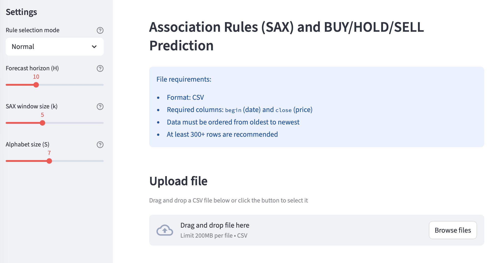
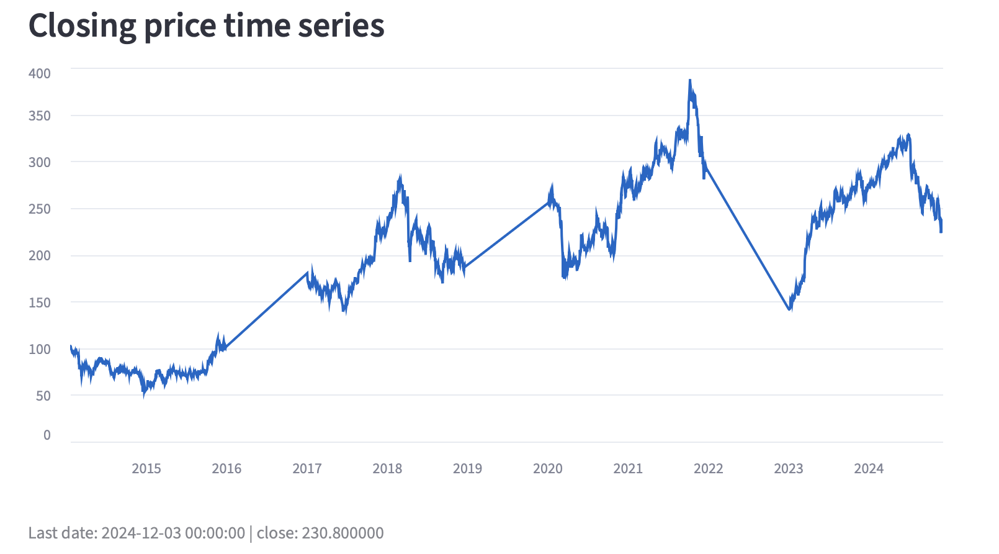
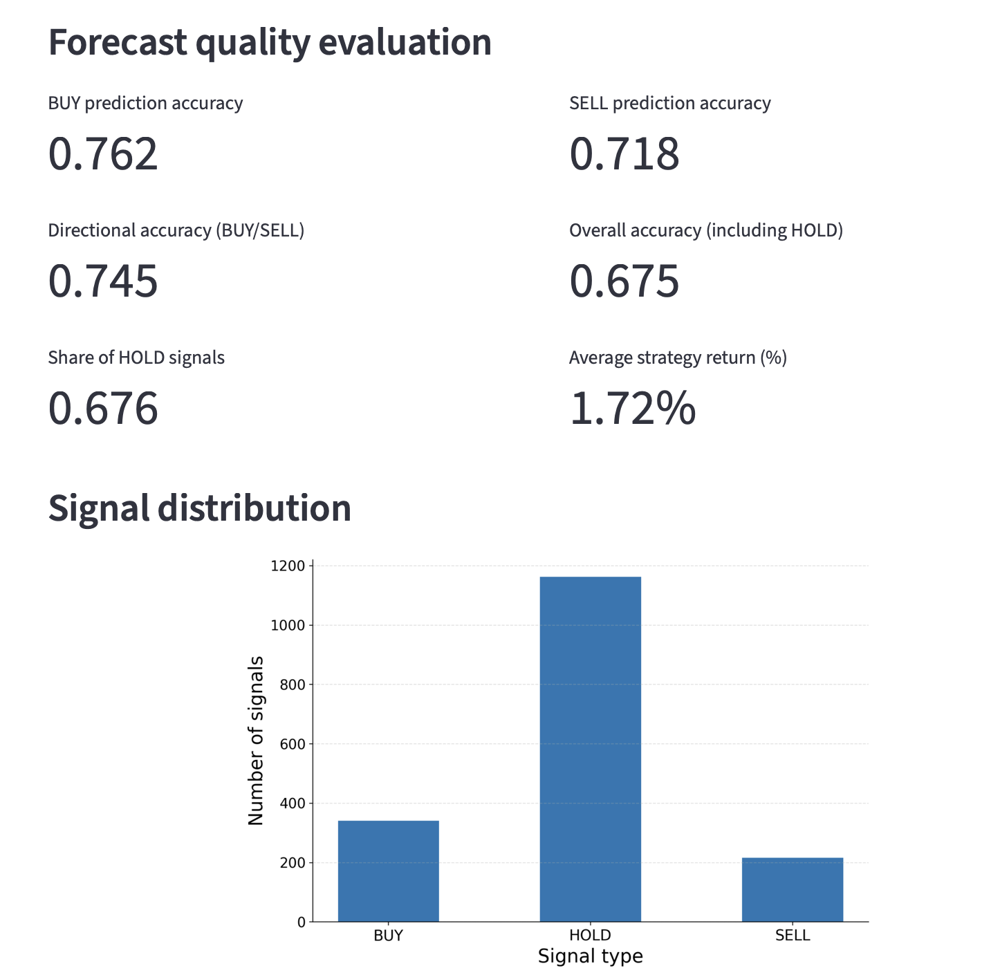
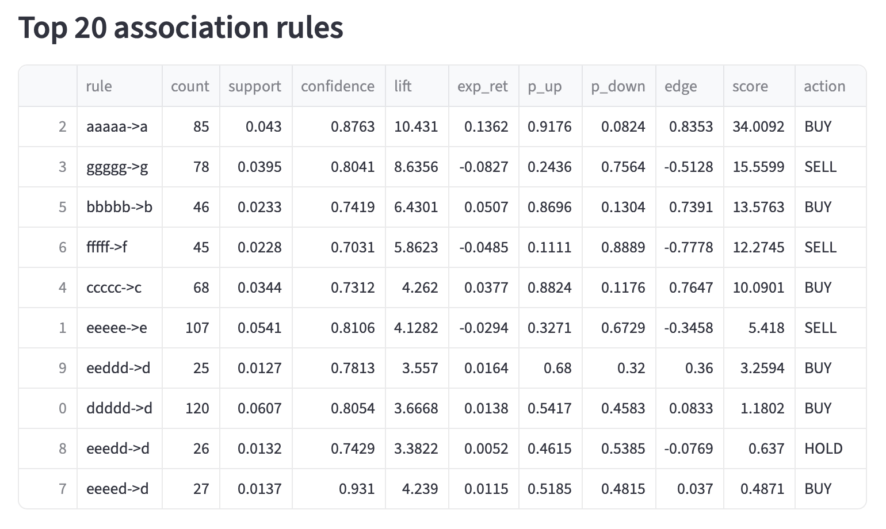
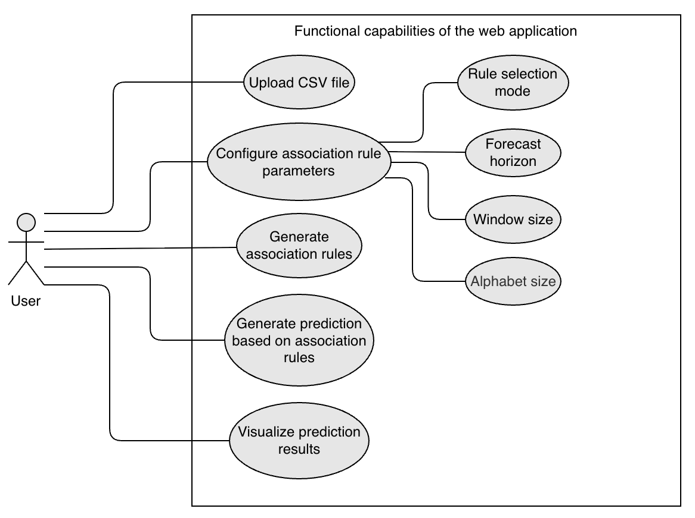

# Financial Time Series Forecasting using SAX and Association Rules

This project implements a method for forecasting financial time series using SAX (Symbolic Aggregate approXimation) and association rules.

The approach focuses on discovering recurring patterns in price dynamics and transforming them into interpretable trading signals: BUY, SELL, or HOLD.

The model converts a time series into a symbolic representation and extracts association rules that capture underlying patterns in the data.

---

## Description

The method combines signal processing and symbolic representation techniques:

1. The original time series is filtered using the Hodrick–Prescott (HP) filter to extract the cyclical component

2. The signal is smoothed using a moving average

3. The series is normalized and discretized using SAX

4. Symbolic sequences are used to build association rules of the form:

   abcde → f

5. For each rule, statistical characteristics are calculated:

   * support
   * confidence
   * lift
   * expected return
   * probability of upward and downward movement

6. Trading signals are generated based on:

   * probability thresholds
   * expected return
   * rule strength

---

## Use Cases

The method can be applied in the following scenarios:

* financial market analysis
* algorithmic trading research
* time series pattern discovery

---

## Functionality

The project includes:

* preprocessing of financial time series
* SAX discretization
* extraction of association rules
* walk-forward validation without data leakage
* generation of trading signals
* evaluation of prediction accuracy
* calculation of strategy returns

---

## Streamlit Application

The repository includes an interactive web application that allows:

* uploading a CSV file with time series data
* configuring model parameters
* viewing predictions and evaluation metrics
* exploring generated association rules

---

### Main Screen

The main interface of the application with parameter configuration and CSV file upload.

### Time Series Visualization

Visualization of the processed time series after filtering and smoothing.

### Prediction Metrics

Evaluation metrics including accuracy of predictions and strategy performance.

### Trading Signal

Final trading recommendation (BUY, SELL, or HOLD) generated by the model.

### Association Rules

Top association rules extracted from the symbolic time series representation.

## System Design

### Use Case Diagram

Use case diagram illustrating the functionality of the web application.

---

## Project Structure

```
.
├── app.py
├── main.py
├── elbow_method.py
├── README.md
```

---

## Installation

Install dependencies:

```bash
pip install -r requirements.txt
```

---

## Run

To run the web application:

```bash
streamlit run app.py
```

---

## Requirements

* Python 3.9+
* pandas
* numpy
* scipy
* matplotlib
* streamlit

---

## Notes

* The application interface is in Russian
* The method can be applied to different types of time series
* The project demonstrates an experimental approach to time series forecasting based on symbolic representation and pattern mining

---

## Author

Ekaterina Polosmak

