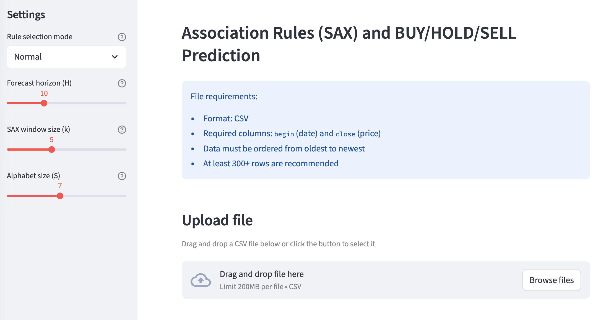
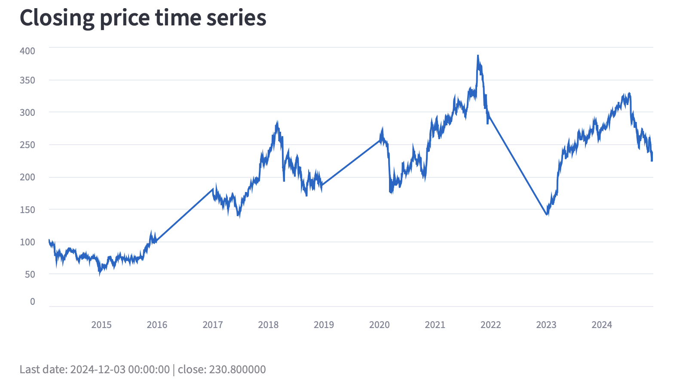
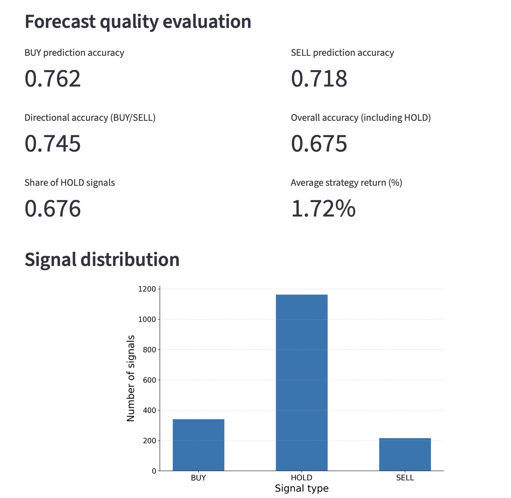
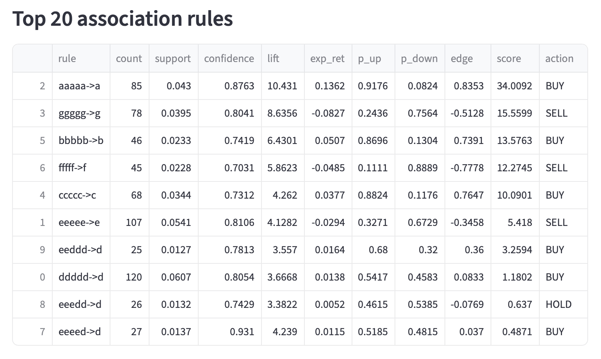
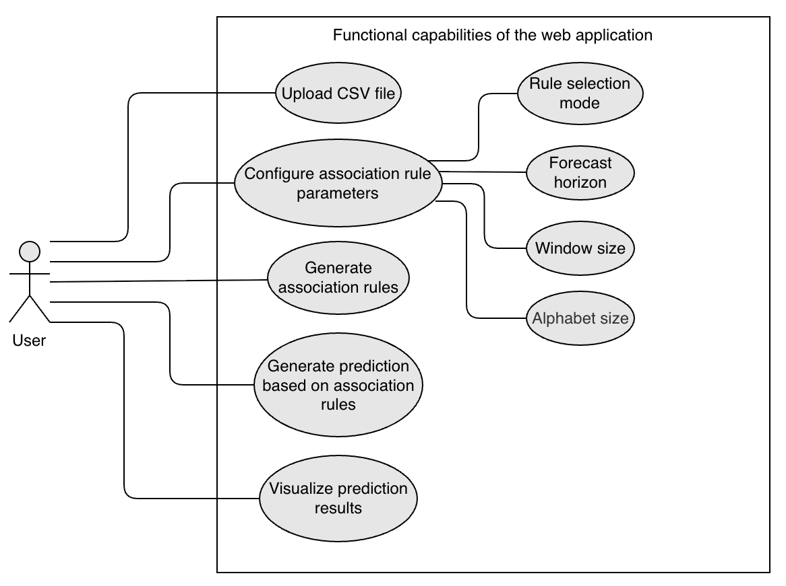

# Financial Time Series Forecasting using SAX and Association Rules

The approach focuses on discovering recurring patterns in price dynamics and transforming them into interpretable trading signals: BUY, SELL, or HOLD.

The model converts a time series into a symbolic representation and extracts association rules that capture underlying patterns in the data.

---

## Motivation

Forecasting financial time series remains a challenging task due to noise, non-stationarity, and changing market regimes.

While many modern approaches rely on statistical models or machine learning, this project investigates whether symbolic representations of market behavior can reveal recurring patterns useful for forecasting future price movements.

The proposed method combines SAX discretization and association rule mining to transform historical price dynamics into interpretable trading signals.

---

## Description

The method combines signal processing and symbolic representation techniques:

1. The original time series is filtered using the Hodrick–Prescott (HP) filter to extract the cyclical component

2. The signal is smoothed using a moving average

3. The series is normalized and discretized using SAX

4. Symbolic sequences are used to build association rules of the form:

   abcde → f

5. For each rule, statistical characteristics are calculated:

   * support
   * confidence
   * lift
   * expected return
   * probability of upward and downward movement

6. Trading signals are generated based on:

   * probability thresholds
   * expected return
   * rule strength

The method is evaluated using walk-forward validation and demonstrates consistent predictive performance across different market conditions.

---

## Methodology

The forecasting pipeline consists of the following stages:

### 1. Trend-Cycle Decomposition

The original financial time series is processed using the Hodrick–Prescott (HP) filter to isolate the cyclical component and reduce the influence of long-term trends.

### 2. Signal Smoothing

A moving average is applied to reduce short-term fluctuations and suppress market noise.

### 3. Symbolic Representation

The processed series is normalized and transformed into a Symbolic Aggregate approXimation (SAX) representation. Continuous numerical values are converted into discrete symbols, allowing the time series to be analyzed as a sequence of patterns.

### 4. Association Rule Mining

Sliding symbolic windows are used to generate association rules of the form:

```text
ABCDE → F
```

Each rule represents a recurring relationship between historical patterns and subsequent market behavior.

### 5. Rule Evaluation

For every extracted rule, the following statistical measures are calculated:

- support
- confidence
- lift
- expected return
- probability of upward movement
- probability of downward movement

### 6. Signal Generation

Trading recommendations (BUY, SELL, or HOLD) are generated using a combination of:

- rule confidence
- expected return
- probability thresholds
- rule strength metrics

### 7. Walk-Forward Validation

Model performance is evaluated using walk-forward validation, ensuring that only historical information is available during each prediction step and preventing data leakage.

### Forecasting Pipeline

```text
Financial Time Series
          ↓
      HP Filter
          ↓
   Moving Average
          ↓
    Normalization
          ↓
 SAX Representation
          ↓
Association Rules
          ↓
 Signal Generation
          ↓
Walk-Forward Validation
```

## Use Cases

The method can be applied in the following scenarios:

* financial market analysis
* algorithmic trading research
* time series pattern discovery
* exploratory analysis of non-stationary data

---

## Functionality

The project includes:

* preprocessing of financial time series
* SAX discretization
* extraction of association rules
* walk-forward validation without data leakage
* generation of trading signals
* evaluation of prediction accuracy
* calculation of strategy returns

---

## Streamlit Application

The repository includes an interactive web application that allows:

* uploading a CSV file with time series data
* configuring model parameters
* viewing predictions and evaluation metrics
* exploring generated association rules

---

### Main Screen

The main interface of the application with parameter configuration and CSV file upload.

### Time Series Visualization

Visualization of the processed time series after filtering and smoothing.

### Prediction Metrics

Evaluation metrics including accuracy of predictions and strategy performance.

### Trading Signal

Final trading recommendation (BUY, SELL, or HOLD) generated by the model.

### Association Rules

Top association rules extracted from the symbolic time series representation.

## System Design

### Use Case Diagram

Use case diagram illustrating the functionality of the web application.

---

## Project Structure

```
.
├── app.py
├── main.py
├── elbow_method.py
├── README.md
```

---

## Installation

Install dependencies:

```bash
pip install -r requirements.txt
```

---

## Run

To run the web application:

```bash
streamlit run app.py
```

---

## Requirements

* Python 3.9+
* pandas
* numpy
* scipy
* matplotlib
* streamlit

---

## Notes

* The application interface is in Russian
* The method can be applied to different types of time series
* The project demonstrates an experimental approach to time series forecasting based on symbolic representation and pattern mining

---

## Author

Ekaterina Polosmak

